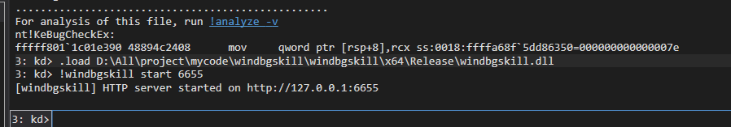

# windbgskill

windbg skill 给AI提供执行windbg命令的能力，适用场景包括但不限于内核/用户进程调试，崩溃转储分析。

## 安装方法

本仓库的 skill 文件位于 `skills/windbg/SKILL.md`，按所用工具放到对应目录：

| 工具 | 路径 |
| --- | --- |
| Cursor | `.cursor/skills/windbg/SKILL.md` |
| Claude Code | `.claude/skills/windbg/SKILL.md` |
| Codex | `.codex/skills/windbg/SKILL.md` |
| OpenCode | `.opencode/skills/windbg/SKILL.md` |
| 其他 agents 工具 | `.agents/skills/windbg/SKILL.md` |

确保 `curl.exe` 在环境变量中，否则你需要告诉AI用其他等价方式访问http端口。

## 用法

在 WinDbg 中执行：

```text
.load D:\Tools\windbgskill\x64\Release\windbgskill.dll
!windbgskill start 6655
```

启动后输出：

```text
[windbgskill] HTTP server started on http://127.0.0.1:6655
```

如需允许其他主机连接，可显式指定 IP：

```text
!windbgskill start 192.168.1.10 6655
```

然后在 agent 中直接告诉 AI：

```text
windbg skill 在 6655 端口就绪，请使用 windbg skill 分析这个转储。
```

或：

```text
windbg skill 在 6655 端口就绪，请使用 windbg skill 调试这个内核。
```

## 演示



